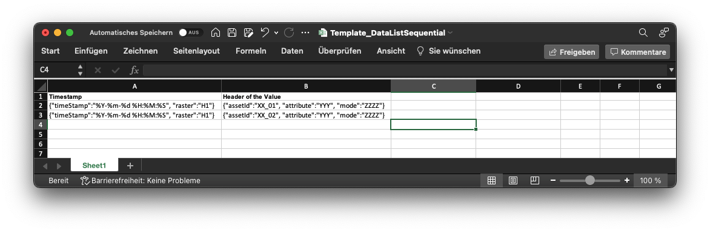

# Purpose

Crete scheduled spreadsheet reports as *.csv or *.xlsx files.
You can create custom reports by using the template files and Konfiguration files.


## Quick start 

Those are the required steps to get started.

- Clone the repository
- Copy the example settings from ./xxxx to ./yyyyy
- Edit the config file to ure desire and add the report settings
- Create or copy the templates
- Test your application
- Create an docker container
- Deploy your app 

## Konfiguration


With the configuration you can define every requested settings in order to set up the reports, the eliona connections and the schedules.

### eliona instance

```JSON
 "eliona_handler": {
    "host": "YOUR_INSTANCE_NAME.eliona.io",
    "api": "https://YOUR_INSTANCE_NAME.eliona.io/api/v2",
    "project_id": 1,
    "api_key": "YOUR_ELIONA_API_KEY"
}
```


|***Configuration***|***Description***|***Example***|
|---|---|---|
|host|Address of the eliona instance without the https|demo.eliona.cloud  
|api|Address of the used api endpoint in this case every time with the https at front |https://develop.eliona.cloud/api/v2|
|project_id|Project number at the used eliona instance. (You can get the number by editing the project and get tne number from the address bar)|1 |
|api_key|The API-Key for the desired eliona instance in order to communicate with the eliona instance|You can get the Key from the eliona engineering Team|  


### Reports  


```JSON

"reports": [
    {
        "name": "Report Name 001",
        "schedule": "monthly",
        "type": "DataListParallel",
        "templateFile": "./tmp_reports/report_001.xlsx",
        "sheet": "Sheet1",
        "fileType": "xlsx",
        "separator":"",
        "firstRow": "0",
        "fromTemplate": true,
        "reportPath": "./tmp_reports/send/report_001.xlsx",
        "receiver": [
            {
                "name": "FirstName LastName",
                "msgType": "email",
                "msgEndpoint": "firstName.LastName@company.ch"
            }                
        ]
    },
    {
        "name": "Report Name 002",
        "schedule": "yearly",
        "type": "DataEntry",
        "templateFile": "./tmp_reports/report_002.csv",
        "sheet": "",
        "fileType": "csv",
        "separator":"\t",
        "firstRow": "0",
        "fromTemplate": true,
        "reportPath": "./tmp_reports/send/report_002.csv",
        "receiver": [
            {
                "name": "FirstName LastName",
                "msgType": "email",
                "msgEndpoint": "firstName.LastName@company.ch"
            }                
        ]
    }
]
```


|***Configuration***|***Description***|***Example***|
|---|---|---|
|name|Set the name of the report. Will be used in logs and the message as reference|Report solar energy building 001 yearly|
|schedule|Set the schedule of the report. Yan be yearly or monthly. Will sent only once at the first day after 6 o'clock.|yearly / monthly|
|type |Define the reporting style|"DataListSequential" = (List underneath)<br> "DataListParallel" = (List parallel)<br>  "DataEntry" = (Single entry in a cell)|
|templateFile|Set the template file path|./templates/syn\_001.xlsx|
|sheet|Sheet name only used if excel file type is used |Tabelle1, Sheet1|
|fileType|Set the required data type|csv, xls, xlsx|
|separator|Separator for csv used spreadsheets only|";" // "," // " "|  
|firstRow|Define the first row to read data from. Default should be 0. The first row will always be ignored as an header|0|  
|fromTemplate|Defines if the report template file will be copied and the data will be set to the cells. Should only be used with excel files. If true every formatting will be kept from the template.|true / false|
|reportPath|Path of the generated report file. Should always be at "./tmp_reports/send"|./tmp_reports/send/report_001.xlsx |
|receiver|List of users to receive the report||           
|name|Sets the name of the receiver. Will be used in the message for text.|FirstName LastName|
|msgType|Selected message type. Currently only eMail is available|email|
|msgEndpoint|Message destination. For type email musst be a valid email address|firstName.LastName@company.ch|


## Templates

There are three different report templates. Each of them can be created as *.csv or *.xlsx file.

### DataListSequential



The time stamp can be configured with the _timeStamp_ as format and the _raster_ as the used steps. The Python dattime time formatting can be used to format the timestamp.

_**Example**_
```json
{
    "timeStamp":"%Y-%m-%d %H:%M:%S", 
    "raster":"H1"
}	
```

The data is configured with the needed _assetId_, the required _attribute_ and the _mode_. 

|Param|Description|
|---|---|
|assetId|The asset id as integer|
|attribute|The Attribute from the asset as string|
|mode|Reads the aggregated data with the given mode <br> - sum <br> - first <br> - last <br> - average <br> - max <br> - min |


_**Example**_
```json
{
    "assetId":"10", 
    "attribute":"power", 
    "mode":"average"
}
```

### DataListParallel


The time stamp can be configured with the _timeStamp_ as format and the _raster_ as the used steps. The Python dattime time formatting can be used to format the timestamp.

_**Example**_
```json
{
    "timeStamp":"%Y-%m-%d %H:%M:%S", 
    "raster":"H1"
}	
```

The data is configured with the needed _assetId_, the required _attribute_ and the _mode_. 

|Param|Description|
|---|---|
|assetId|The asset id as integer|
|attribute|The Attribute from the asset as string|
|mode|Reads the aggregated data with the given mode <br> - sum <br> - first <br> - last <br> - average <br> - max <br> - min |


_**Example**_
```json
{
    "assetId":"10", 
    "attribute":"power", 
    "mode":"average"
}
```


### DataEntry


The time span start and stop can be set with an single parameter each. The Python dattime time formatting can be used to format the timestamp.


_**Example**_
```json
{
    "timeStampStart":"%Y-%m-%d"
}	
```

_**Example**_
```json
{
    "timeStampEnd":"%Y-%m-%d"
}	
```


The data is configured with the needed _assetId_, the required _attribute_ the _mode_ and the raster. 

|Param|Description|
|---|---|
|assetId|The asset id as integer|
|attribute|The Attribute from the asset as string|
|raster|Set the raster of the pipeline. <br> - H1 (Hour) <br> - m1 (month) <br> - year (full year)|
|mode|Reads the aggregated data with the given mode <br> - sum <br> - first <br> - last <br> - average <br> - max <br> - min |


_**Example**_
```json
{
    "assetId":"12", 
    "attribute":"power", 
    "raster":"H1", 
    "mode":"last"
}
```
