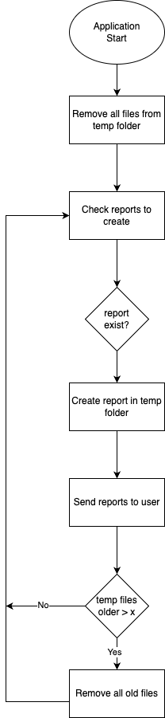

# Purpose

Crete scheduled spreadsheet reports as *.csv or *.xlsx files and send them to the required destination.
You can create custom reports by using template files and the configuration.

# Functionality

The application will gather the information from the aggregated pipelines from eliona and transform the information to the required spreadsheet. The application itself does no manipulation of the data. 
Therefore the required grid needed to be set at the asset type attribute. 

For example: If you would like to get the monthly average value of an attribute, the attribute need to have the monthly pipeline enabled.   


## Quick start 

Those are the required steps to get started.

- Clone the repository
- Copy the example settings from ./xxxx to ./yyyyy
- Edit the config file to ure desire and add the report settings
- Create or copy the templates
- Test your application
- Create an docker container
- Deploy your app 

## Environment Variables

```Shell
# Connection configuration
HOST_DOMAIN="https://customer.eliona.cloud"
API_ENDPOINT="https://customer.eliona.cloud/api/v2"
API_TOKEN = "The super secure api token"
SSL_VERIFY="True"

# Customer configuration
CUSTOMER_NAME="Customer"
TZ="Europe/Zurich"

# App Configuration
APP_NAME="Spreadsheet-Report-App"
SETTINGS_PATH = "./storage/config/config.json"
STORAGE_PATH = "./tmp_reports/reports/"

# Testing and debugging
LOG_LEVEL = "INFO"
TESTING_ENABLED = "False"
```

## Konfiguration


With the configuration you can define every requested settings in order to set up the reports, the eliona connections and the schedules.

### eliona instance

```JSON
 "eliona_handler": {
    "host": "YOUR_INSTANCE_NAME.eliona.io",
    "api": "https://YOUR_INSTANCE_NAME.eliona.io/api/v2",
    "projectId": 1,
    "apiKey": "YOUR_ELIONA_API_KEY",
    "dbTimeZone": 2
}
```

|***Configuration***|***Description***|***Example***|
|---|---|---|
|host|Address of the eliona instance without the https|demo.eliona.cloud  
|api|Address of the used api endpoint in this case every time with the https at front |https://develop.eliona.cloud/api/v2|
|projectId|Project number at the used eliona instance. (You can get the number by editing the project and get tne number from the address bar)|1 |
|apiKey|The API-Key for the desired eliona instance in order to communicate with the eliona instance|You can get the Key from the eliona engineering Team|
|dbTimeZone|Defines the timezone the data was stored in the database. Enter the UTC offset as integer.|

### Report Scheduler

You can ether create an user based or report based schedule. If you like you can also mixe them together. The user based report will combine all reports to one attachment and send them to the required user. This will generate one mail per user even tho the user will receive multiple reports. With the report based schedule you will send one mail per report to different users. The mail will send by blind copy to every user. With this schedule one user may receive multiple mails. One mail for each report.

|***Configuration***|***Description***|***Example***|
|---|---|---|
|name|Set the name of the report. Will be used in logs and the message as reference|Report solar energy building 001 yearly|
|schedule|Set the schedule of the report. Yan be yearly or monthly. Will sent only once at the first day after 6 o'clock.|yearly / monthly|
|type |Define the reporting style|"DataListSequential" = (List underneath)<br> "DataListParallel" = (List parallel)<br>  "DataEntry" = (Single entry in a cell)|
|templateFile|Set the template file path|./templates/syn\_001.xlsx|
|sheet|Sheet name only used if excel file type is used |Tabelle1, Sheet1|
|fileType|Set the required data type|csv, xls, xlsx|
|separator|Separator for csv used spreadsheets only|";" // "," // " "|  
|firstRow|Define the first row to read data from. Default should be 0. The first row will always be ignored as an header|0|  
|fromTemplate|Defines if the report template file will be copied and the data will be set to the cells. Should only be used with excel files. If true every formatting will be kept from the template.|true / false|
|reportPath|Path of the generated report file. Should always be at "./tmp_reports/send"|./tmp_reports/send/report_001.xlsx |
|receiver|List of users to receive the report||           
|name|Sets the name of the receiver. Will be used in the message for text.|FirstName LastName|
|msgType|Selected message type. Currently only eMail is available|email|
|msgEndpoint|Message destination. For type email musst be a valid email address|firstName.LastName@company.ch|
|fillNone|[optional] Fill the non existing data with previous ore following data. If True the previous value will be used. If not available the first available tailing value will be used. Default value is True|False|


### Reports  

```JSON

"reports": [
    {
        "name": "Report Name 001",
        "schedule": "monthly",
        "type": "DataListParallel",
        "templateFile": "./tmp_reports/report_001.xlsx",
        "sheet": "Sheet1",
        "fileType": "xlsx",
        "separator":"",
        "firstRow": "0",
        "fromTemplate": true,
        "reportPath": "./tmp_reports/send/report_001.xlsx",
        "receiver": [
            {
                "name": "FirstName LastName",
                "msgType": "email",
                "msgEndpoint": "firstName.LastName@company.ch"
            }                
        ]
    },
    {
        "name": "Report Name 002",
        "schedule": "yearly",
        "type": "DataEntry",
        "templateFile": "./tmp_reports/report_002.csv",
        "sheet": "",
        "fileType": "csv",
        "separator":"\t",
        "firstRow": "0",
        "fromTemplate": true,
        "reportPath": "./tmp_reports/send/report_002.csv",
        "fillNone": false,
        "receiver": [
            {
                "name": "FirstName LastName",
                "msgType": "email",
                "msgEndpoint": "firstName.LastName@company.ch"
            }                
        ]
    }
]
```


### Users  

```JSON

"users": [
    {
        "name": "FirstName001 LastName001",
        "msgType": "email",
        "msgEndpoint": "firstName001.LastName001@company.ch",
        "reports": ["Report 003"]
    },
    {
        "name": "FirstName002 LastName002",
        "msgType": "email",
        "msgEndpoint": "firstName002.LastName002@company.ch",
        "reports": ["Report 003", "Report 004"]
    }
 
]

"reportConfig": [
    {
        "name": "Report 003",
        "schedule": "monthly",
        "type": "DataEntry",
        "templateFile": "./tmp_reports/Cust_Config/Template_ReportName003.xlsx",
        "sheet": "Sheet1",
        "separator":";",
        "firstRow": "0",
        "fromTemplate": true,
        "reportPath": "Report_Name_003.xlsx",
        "fillNone": false,
        "tempPath": ""
    },
    {
        "name": "Report 004",
        "schedule": "monthly",
        "type": "DataEntry",
        "templateFile": "./tmp_reports/Cust_Config/Template_ReportName004.xlsx",
        "sheet": "Sheet1",
        "separator":";",
        "firstRow": "0",
        "fromTemplate": true,
        "reportPath": "Report_Name_004.xlsx",
        "tempPath": ""
    }
]

```


## Templates

There are three different report templates. Each of them can be created as *.csv or *.xlsx file.

### DataListSequential


The time stamp can be configured with the _timeStamp_ as format and the _raster_ as the used steps. The Python dattime time formatting can be used to format the timestamp.

_**Example**_
```json
{
    "timeStamp":"%Y-%m-%d %H:%M:%S", 
    "raster":"H1"
}	
```

The data is configured with the needed _assetId_, the required _attribute_ and the _mode_. 

|Param|Description|
|---|---|
|assetId|The asset id as integer|
|attribute|The Attribute from the asset as string|
|mode|Reads the aggregated data with the given mode <br> - sum <br> - first <br> - last <br> - average <br> - max <br> - min |


_**Example**_
```json
{
    "assetId":"10", 
    "attribute":"power", 
    "mode":"average"
}
```

### DataListParallel


The time stamp can be configured with the _timeStamp_ as format and the _raster_ as the used steps. The Python dattime time formatting can be used to format the timestamp.

_**Example**_
```json
{
    "timeStamp":"%Y-%m-%d %H:%M:%S", 
    "raster":"H1"
}	
```

The data is configured with the needed _assetId_, the required _attribute_ and the _mode_. 

|Param|Description|
|---|---|
|assetId|The asset id as integer|
|attribute|The Attribute from the asset as string|
|mode|Reads the aggregated data with the given mode <br> - sum <br> - first <br> - last <br> - average <br> - max <br> - min |


_**Example**_
```json
{
    "assetId":"10", 
    "attribute":"power", 
    "mode":"average"
}
```


### DataEntry


The time span start and stop can be set with an single parameter each. The Python dattime time formatting can be used to format the timestamp.


_**Example**_
```json
{
    "timeStampStart":"%Y-%m-%d"
}	
```

_**Example**_
```json
{
    "timeStampEnd":"%Y-%m-%d"
}	
```


The data is configured with the needed _assetId_, the required _attribute_ the _mode_ and the raster. 

|Param|Description|
|---|---|
|assetId|The asset id as integer|
|attribute|The Attribute from the asset as string|
|raster|Set the raster of the pipeline. <br> - M15 (15 Minutes) <br> - H1 (Hour) <br> - MONTH (One Month) <br> - YEAR (full year)|
|mode|Reads the aggregated data with the given mode <br> - sum <br> - first <br> - last <br> - average <br> - max <br> - min |


_**Example**_
```json
{
    "assetId":"12", 
    "attribute":"power", 
    "raster":"H1", 
    "mode":"last"
}
```


# Technical description

## Container usage


In order to use the application in an containerized environment ether the docker or the docker compose file can be used.
The base image used is an alpine linux with python and preinstalled pandas and numpy modules.

Here is the list of the available environment variables.

# Connection configuration

|Environment Variable|Description|
|---|---|
|HOST_DOMAIN|eliona url|
|API_ENDPOINT|API endpoint. Should be: HOST_DOMAIN/api/v2 |
|API_TOKEN|API Token for the eliona instance|
|SSL_VERIFY|Should always be True. In cases with no certificate for testing purpose only. Can be set to False|
|CUSTOMER_NAME|Name of the Customer|
|TZ|Time Zone Info. For Example: "Europe/Zurich"|
|APP_NAME|Name of the Application for the Loggs|
|SETTINGS_PATH|Path of the Settings Should always be: "./storage/config/config.json" since the storage is mounted to an volume|
|STORAGE_PATH|Should be always be "./storage/" |
|LOG_LEVEL| Can be set to: "DEBUG", "ERROR", "WARNING", "INFO":|
|TESTING_ENABLED|Enables the Testing wit a given time table|


## Call the Python Script

In Order to debug and Test the Script it can be called with these Parameters:

```console
python ./src/spreadsheet-report-app/spreadsheet_report_app.py -m runtime -c ./storage/config/config.json -s ./storage/reports/ -l INFO -t True
```

If you would like to call a single User or Report you can use:

python ./src/spreadsheet-report-app/spreadsheet_report_app.py -m single -c ./storage/config/config.json -s ./storage/reports/ -l INFO -t False


### API calls

To get the data we need to get the Asset ID and the aggregation ID to reduce to overhead for the retrieved aggregated data. Here is the workflow.


### Temp file handling

In order to send the data the reports will be created in an temporary folder. The report will only be created once if it needed to be send to multiple users. The handling of the temporary files will be like this:


